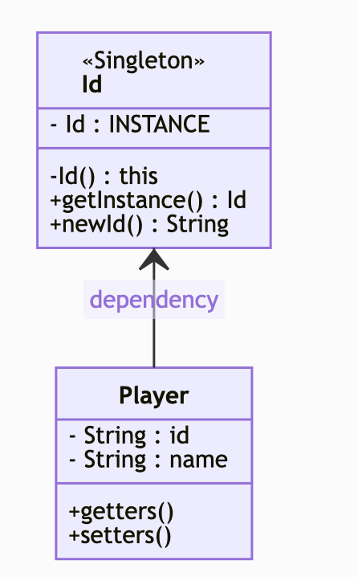
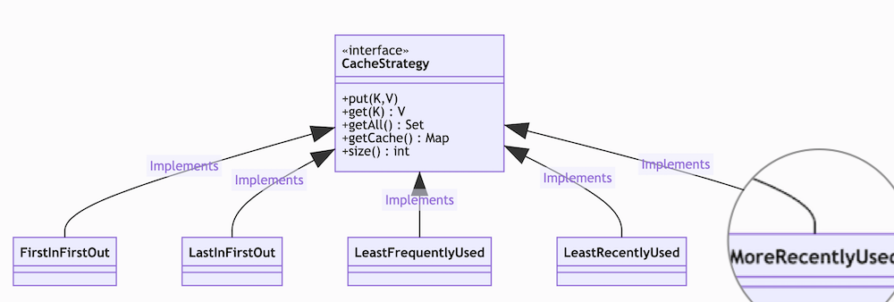
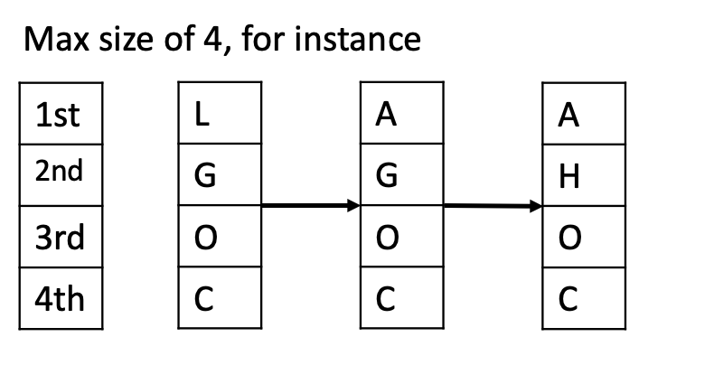
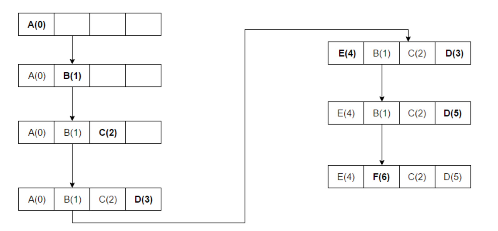
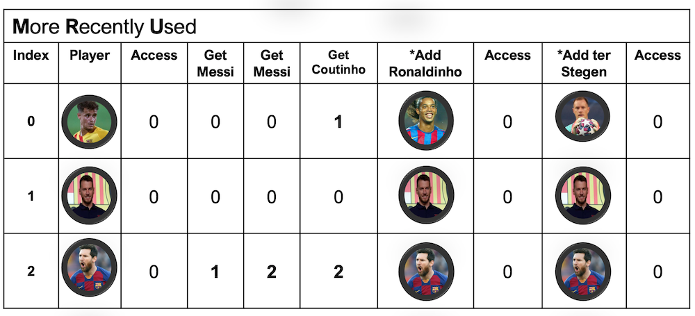
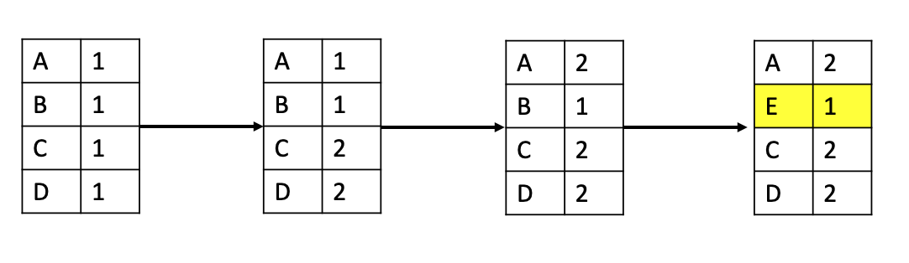

#Cache eviction policies

## Domain
The domain for the examples is very simple, but if you want, any class (domain) could be used.

## Cache strategy diagram

## First In First Out (FIFO): 
The cache evicts the first block accessed first without any regard to how often or how many times it was accessed before.

## Last In First Out (LIFO): 
The cache evicts the block accessed most recently first without any regard to how often or how many times it was accessed before.

## Least Recently Used (LRU): 
Discards the least recently used items first.

## Most Recently Used (MRU): 
Discards, in contrast to LRU, the most recently used items first.

## Least Frequently Used (LFU): 
Counts how often an item is needed. Those that are used least often are discarded first.

## Tech stack
* Java 8
* Maven
* Generics
* FIFO
* LRU
* LFU
* MRU
* JUnit 5
* Assertions

## References
[Interview Cake](https://www.interviewcake.com/concept/java/lru-cache)

[Wikipedia ES](https://es.wikipedia.org/wiki/Algoritmo_de_cach%C3%A9)

[Programmers Ought](https://www.programmersought.com/article/35722271759/)

[StackOverflow](https://stackoverflow.com/questions/5088128/why-does-cache-use-most-recently-used-mru-algorithm-as-evict-policy)

[TechTarget](https://searchstorage.techtarget.com/definition/cache-algorithm)

[spatnaik77](https://spatnaik77.wordpress.com/2014/06/13/simple-lrumru-based-cache-in-java/)